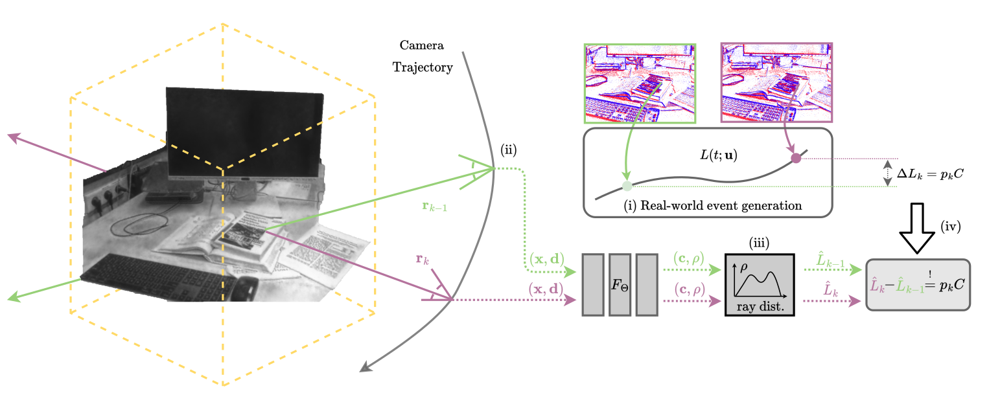

# E-NeRF

E-NeRF computes a Neural Radiance Field from [event-camera](https://arxiv.org/pdf/1904.08405.pdf) data. It is a joint work by 

<p align="center">
    <a href="https://vision.in.tum.de/members/klenk">Simon Klenk</a><sup>1</sup> &emsp;
    <a href="https://lukaskoestler.com">Lukas Koestler</a><sup>1</sup> &emsp;
    <a href="https://rpg.ifi.uzh.ch/people_scaramuzza.html">Davide Scaramuzza</a><sup>2</sup> &emsp;
    <a href="https://vision.in.tum.de/members/cremers">Daniel Cremers</a><sup>1</sup> &emsp;
</p>

<p align="center">
    <sub> <sup>1</sup>Computer Vision Group, Technical University of Munich, Germany <br> &emsp;
    <sup>2</sup> Robotics and Perception Group, University of Zurich, Switzerland.</sup> &emsp;
</p>

<p align="center">
    IEEE Robotics and Automation Letters (RA-L), 2023 & <br>
    International Conference on Intelligent Robots and Systems (IROS), 2023
</p>




If you use this code or our paper results, please cite our work. <a href="https://arxiv.org/abs/2208.11300">link to paper</a> <br>

```
@article{klenk2022nerf,
  title={E-NeRF: Neural Radiance Fields from a Moving Event Camera},
  author={Klenk, Simon and Koestler, Lukas and Scaramuzza, Davide and Cremers, Daniel},
  journal={IEEE Robotics and Automation Letters},
  year={2023}
} 
```

## Data
Datasets were simulated using [esim](https://github.com/uzh-rpg/rpg_esim). It can be found under [https://vision.in.tum.de/research/enerf](https://vision.in.tum.de/research/enerf).

## Code


Our python implementation is based on [torch-ngp](https://github.com/ashawkey/torch-ngp) - a pytorch implementation of [instant-ngp](https://github.com/NVlabs/instant-ngp), as described in [_Instant Neural Graphics Primitives with a Multiresolution Hash Encoding_](https://nvlabs.github.io/instant-ngp/assets/mueller2022instant.pdf).


# Install
```bash
git clone --recursive https://github.com/knelk/enerf
cd enerf
```


### Install with conda
```bash
conda env create -f environment.yml
conda activate enerf
```

### Install with pip
```bash
python3 -m venv env
source env/bin/activate
pip install -r requirements.txt
```

### Tested environments
* Ubuntu 20.04 with torch 1.10 & CUDA 11.12.2 on an NVIDIA RTX A4000.

# Usage
We support 3 data formats: esim, [tumvie](https://vision.in.tum.de/data/datasets/visual-inertial-event-dataset), and [eds](https://rpg.ifi.uzh.ch/eds.html). The data format is quite flexible and easy-to-adapt, e.g. to feed COLMAP poses or similar (have a look at ``nerf/provider.py`` and the ``scripts`` folder for data preprocessing, and associated issues in [torch-ngp](https://github.com/ashawkey/torch-ngp)).

### Training
``./configs`` should be a good starting point to understand the most important flags of our code. Important event-related flags include ``C_thres`` (-1 for using the normalized loss function), ``events`` (boolean), ``event_only`` (boolean) and ``accumulate_evs`` (boolean). The scene is assumed to be in `[-bound, bound]`, and centered at `(0, 0, 0)`. 

Please refer to [torch-ngp](https://github.com/ashawkey/torch-ngp) and its issues for more details regarding the installation, usage and scene assumptions.

### Data Preprocessing:
- Check the scripts folder.
- For [tumvie](https://vision.in.tum.de/data/datasets/visual-inertial-event-dataset), download data to ``TUMVIEDATA``. Left grayscale camera = camId0, right grayscale camera = camId1.
- Run ``python ./scripts/undistort_images_tumvie.py --indir TUMVIEDATA --camId 0`` to undistort the left images, events (by creating rectify_map_left/right.h5), and intrinsics. Before running the script, copy the respective calibration file (e.g. ``camera-calibrationA.json`` for ``mocap-desk2``) as ``calibration.json`` into ``TUMVIEDATA``, and copy the respective imu-calibration file (e.g. ``camera-calibrationA.json`` for ``mocap-desk2``) as ``mocap-imu-calib.json`` into ``TUMVIEDATA``. See [tumvie](https://vision.in.tum.de/data/datasets/visual-inertial-event-dataset) homepage for details.
- Similarly, run ``./scripts/undistort_images_eds.py`` to undistort the images, events (by creating rectify_map_left/right.h5), and intrinsics of the [eds dataset](https://rpg.ifi.uzh.ch/eds.html) (download tgz version).

### Rendering
We provide a script for rendering. For example, to render the trained E-NeRF model at the keyframe (kfs) validation (val) poses, simply run ``python scripts/render.py --model_dir EXPDIR --infile EXPDIR/val_final_quatlist_kfs_ns.txt``. If you want random poses (around the training poses), do not provide and ``infile`` and set ``rand_poses=1``.

### Troubleshooting
- Take care that the poses you provide are in the correct format (right_up_back, check e.g. this [issue](https://github.com/kwea123/nerf_pl/issues/58) or this [issue](https://github.com/Fyusion/LLFF/issues/10) which also explains the idea behind ``poses_bounds.py`` format). 
- Take care to undistort the images/events/e2vid-reconstructions that you are feeding to the NeRF model, as described above in **Data Preprocessing**.
- If the program sometimes does not start due to CUDA issues (or it gets stuck after loading the model), I often found it useful to clear the cache ``rm -rf ~/.cupy/  ~/.ccache/ ~/.cache/``, and sometimes (``rm -rf __pycache__/ raymarching/__pycache__/ gridencoder/__pycache__/ utils/__pycache__/ nerf/__pycache__/ shencoder/__pycache__/``).

# Acknowledgement
* [torch-ngp](https://github.com/ashawkey/torch-ngp): 
```
@misc{torch-ngp,
    Author = {Jiaxiang Tang},
    Year = {2022},
    Note = {https://github.com/ashawkey/torch-ngp},
    Title = {Torch-ngp: a PyTorch implementation of instant-ngp}
}
```

* [tiny-cuda-nn](https://github.com/NVlabs/tiny-cuda-nn) and [instant-ngp](https://github.com/NVlabs/instant-ngp):
    ```
    @misc{tiny-cuda-nn,
        Author = {Thomas M\"uller},
        Year = {2021},
        Note = {https://github.com/nvlabs/tiny-cuda-nn},
        Title = {Tiny {CUDA} Neural Network Framework}
    }

    @article{mueller2022instant,
        title = {Instant Neural Graphics Primitives with a Multiresolution Hash Encoding},
        author = {Thomas M\"uller and Alex Evans and Christoph Schied and Alexander Keller},
        journal = {arXiv:2201.05989},
        year = {2022},
        month = jan
    }
    ```

* The [tumvie](https://vision.in.tum.de/data/datasets/visual-inertial-event-dataset) dataset:
```
@inproceedings{klenk2021tum,
  title={Tum-vie: The tum stereo visual-inertial event dataset},
  author={Klenk, Simon and Chui, Jason and Demmel, Nikolaus and Cremers, Daniel},
  booktitle={2021 IEEE/RSJ International Conference on Intelligent Robots and Systems (IROS)},
  pages={8601--8608},
  year={2021},
  organization={IEEE}
}
```

* The [eds](https://rpg.ifi.uzh.ch/eds.html) dataset:
```
 @inproceedings{hidalgo2022event,
  title={Event-aided Direct Sparse Odometry},
  author={Hidalgo-Carri{\'o}, Javier and Gallego, Guillermo and Scaramuzza, Davide},
  booktitle={Proceedings of the IEEE/CVF Conference on Computer Vision and Pattern Recognition},
  pages={5781--5790},
  year={2022}
}
```

* E2VID reconstruction were created with this repository: [e2calib](https://github.com/uzh-rpg/e2calib)


```
@Article{Rebecq19pami,
  author        = {Henri Rebecq and Ren{\'{e}} Ranftl and Vladlen Koltun and Davide Scaramuzza},
  title         = {High Speed and High Dynamic Range Video with an Event Camera},
  journal       = {{IEEE} Trans. Pattern Anal. Mach. Intell. (T-PAMI)},
  url           = {http://rpg.ifi.uzh.ch/docs/TPAMI19_Rebecq.pdf},
  year          = 2019
}
```